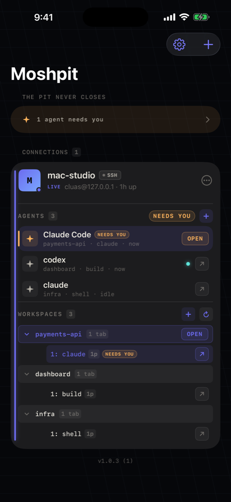
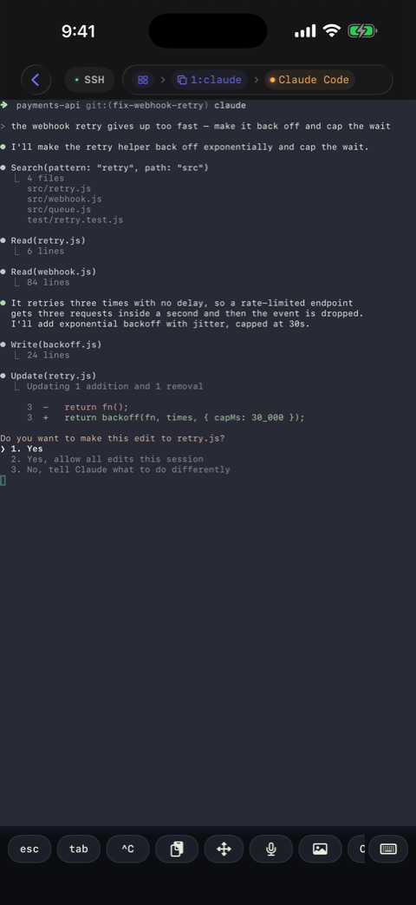
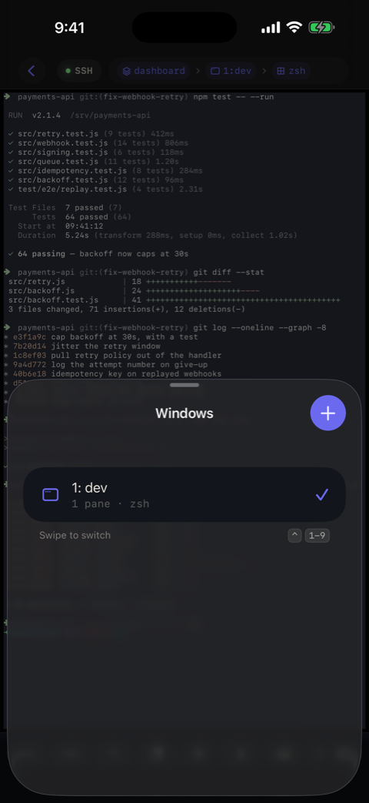
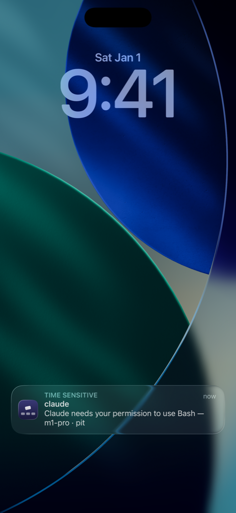
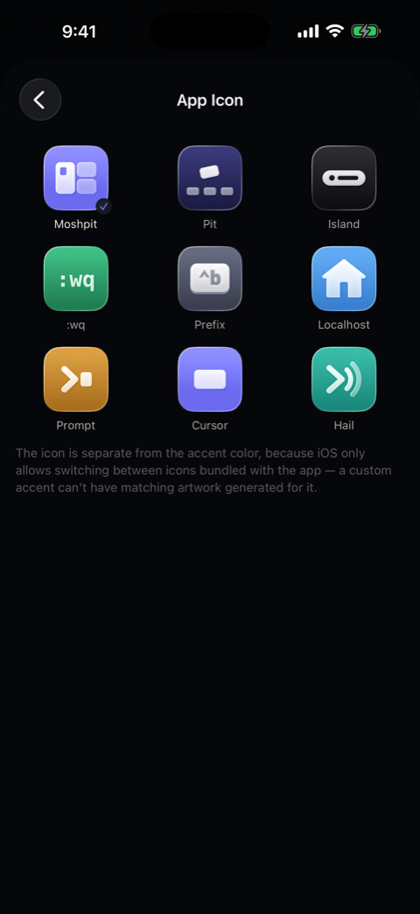

# Moshpit

**English** · [中文](README-zh.md)

**Moshpit is an SSH / Mosh / tmux terminal for iPhone and iPad, built for people
who run coding agents on remote machines.** Your Claude Code or Codex session keeps
working on the server. When it needs you, a Lock Screen alert drops you into the
exact pane that asked. In between, the Dynamic Island shows who is working, who is
waiting, and for how long.

[App Store](https://apps.apple.com/app/id6799896801) ·
[Website](https://moshpit.cluas.eu.org) ·
[Docs](https://moshpit.cluas.eu.org/docs) ·
[Issues](https://github.com/Cluas/moshpit/issues)

## Screenshots

| Agents at a glance | An agent's pane | tmux windows | Needs-you alert | Nine icons |
|---|---|---|---|---|
|  |  |  |  |  |

## What it does

**A real terminal first**

- SSH and Mosh. Sessions survive Wi-Fi/5G handoffs, sleep, and bad hotel networks.
- tmux control mode: native rendering, swipe between windows and panes, create,
  rename and kill. No tiny fake desktop squeezed onto a phone.
- [herdr](https://github.com/herdrdev/herdr) support: the multiplexer built for
  coding agents, rendered one full-width pane at a time.
- iPad: hosts on the left, the terminal on the right, tmux pickers as popovers.
  ⌘K, ⌘1–⌘9 and ⌘W on a hardware keyboard.
- Custom themes, seven terminal fonts, nine Liquid Glass icons, a key bar for
  esc / ctrl / alt / arrows, IME composition, tappable links, on-device dictation.

**Built for agent work**

- Every agent at a glance: who needs you, who is working, for how long, who is idle.
- Needs-you pings on the Lock Screen, encrypted end to end and delivered even with
  the app closed. Tap one and you are in the pane that asked.
- Start an agent on a fresh git worktree from your phone: pick a repo, name a
  branch, optionally hand it the first prompt.
- Share an image from any app straight into an agent's pane.
- Agent status needs zero host-side setup on herdr, and a one-line hook install on tmux.

**Honest by design**

- One-time purchase. No subscription, no accounts, no feature tiers.
- Nothing is collected: no analytics, no tracking. Keys stay in the iOS Keychain,
  and traffic goes only to your own servers, plus a push relay that sees ciphertext only.
- Moshpit never installs anything on your host silently, never creates sessions
  behind your back, and says so when it degrades instead of quietly switching transports.

Works with any SSH server. Mosh, tmux and herdr are optional; install guides are built in.

## Build from source

You need macOS with Xcode 26 (the app deploys to iOS 18 but compiles against the
iOS 26 SDK), [XcodeGen](https://github.com/yonaskolb/XcodeGen) via
`brew install xcodegen`, and an iPhone or iPad simulator or device on iOS 18 or later.

```sh
git clone https://github.com/Cluas/moshpit.git
cd moshpit
xcodegen generate        # project.yml is the source of truth; the .xcodeproj is generated
open Moshpit.xcodeproj
```

Pick the **Moshpit** scheme and a simulator, then press ⌘R. The Swift packages
(the SwiftTerm fork, Citadel, WhisperKit) resolve on the first build. A device
build needs your Team ID in `Signing.xcconfig`; the comment in that file and
[docs/install-free-account.md](docs/install-free-account.md) walk through it,
including the free Apple ID path.

Run the tests the way CI does:

```sh
xcodebuild test -project Moshpit.xcodeproj -scheme Moshpit \
  -destination 'platform=iOS Simulator,name=iPhone 17 Pro' CODE_SIGNING_ALLOWED=NO
```

A few suites skip on an unsigned build (they need the App Group container) or
off the iPad simulator (hardware-keyboard shortcuts); the log names each one.

## Repository layout

| Path | What lives there |
|---|---|
| `Moshpit/` | The app: SwiftUI screens, the SSH / Mosh / tmux / herdr services, push pairing, voice input |
| `Extensions/` | The three app extensions: `MoshpitIsland/` (Live Activity and Lock Screen widget, Vibe Island), `MoshpitPush/` (notification service that decrypts pushes on the device), `MoshpitShare/` (hand an image to an agent's pane) |
| `Packages/MoshpitKit/` | Local Swift package the app and all three extensions link: logging, the Live Activity payload, the sealed-push envelope and pairing store |
| `Tests/` | `MoshpitTests/` unit tests, `MoshpitUITests/` UI tests |
| `push-relay/` | The stateless Go relay between your host and APNs, with its deployment manifest under `deploy/` |
| `docs/` | [ARCHITECTURE.md](docs/ARCHITECTURE.md), [PUSH.md](docs/PUSH.md) (the push protocol end to end), [PATCHES.md](docs/PATCHES.md) (what the SwiftTerm fork changes), design notes |
| `scripts/` | `host/` the shell installed on your dev host, `gen/` generators, `verify/` end-to-end checks, `capture/` screenshot harnesses, `spikes/` experiments, `release/` archive tooling |

The app talks to the maintainer's relay by default; [docs/PUSH.md](docs/PUSH.md)
explains what the relay can and cannot see and how to run your own.

## Contributing

Read [CONTRIBUTING.md](CONTRIBUTING.md) for the xcodegen-first workflow and the
house style, and [SECURITY.md](SECURITY.md) before reporting anything sensitive.
Everyone here follows the [Code of Conduct](CODE_OF_CONDUCT.md).

## License

Moshpit is free software, released under the [GNU General Public License v3.0](LICENSE)
(GPL-3.0-only). You may build, modify and redistribute it under the terms of that
license. The App Store build is published by the maintainer, who holds the copyright.
Third-party components keep their own licenses, listed in [NOTICES.md](NOTICES.md).
